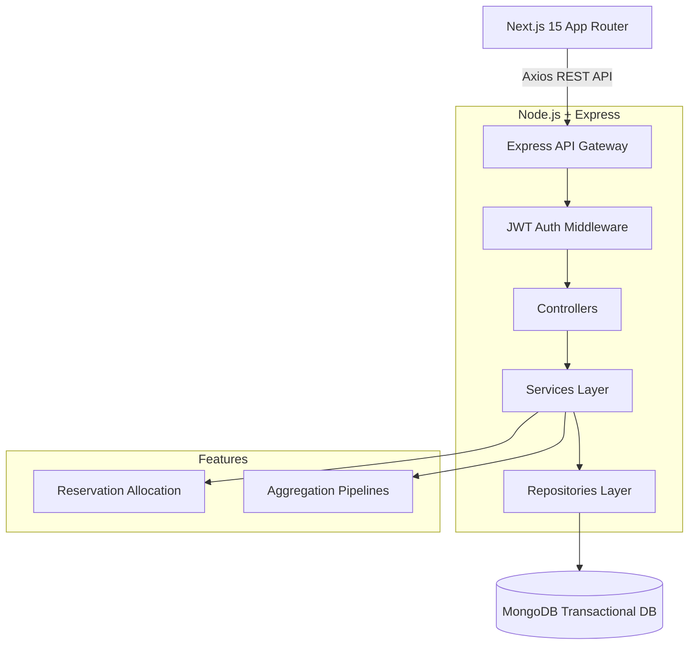
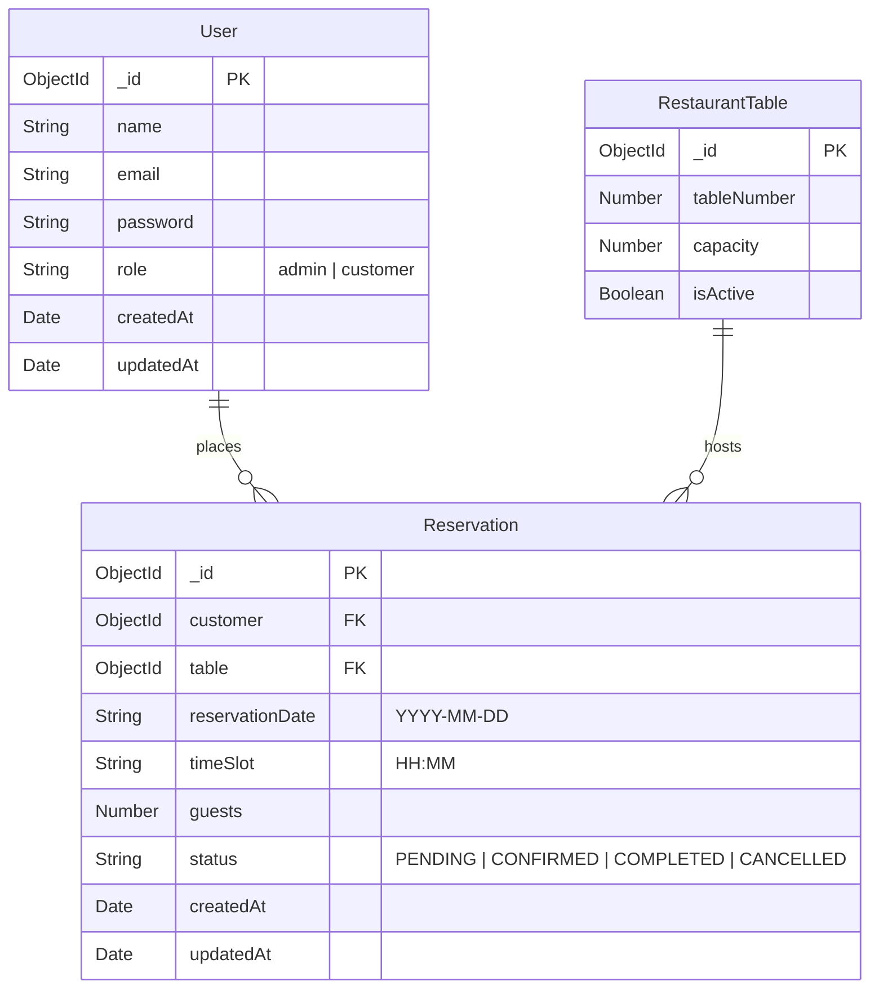

# TableFlow – Smart Restaurant Reservation Platform

TableFlow is a premium, production-grade SaaS application designed for luxury restaurants, fine dining establishments, and high-end hospitality venues. It provides an elegant, Apple-inspired user interface backed by a robust Node.js/MongoDB reservation engine with double-booking prevention.

## Table of Contents
- [Architecture](#architecture)
- [Database Schema (ER Diagram)](#database-schema)
- [Folder Structure](#folder-structure)
- [Installation Guide](#installation-guide)
- [Authentication Flow](#authentication-flow)
- [Reservation Allocation Algorithm](#reservation-allocation-algorithm)
- [Future Improvements & Known Limitations](#future-improvements--known-limitations)

---

## Architecture

TableFlow utilizes a decoupled Client-Server architecture following Clean Architecture principles on the backend.



## Database Schema



## Folder Structure

```text
TableFlow/
├── backend/
│   ├── src/
│   │   ├── config/          # DB and environment configuration
│   │   ├── constants/       # Enums and fixed values
│   │   ├── controllers/     # Request/Response parsing
│   │   ├── middleware/      # Auth and Error handling
│   │   ├── models/          # Mongoose Schemas
│   │   ├── repositories/    # Database queries
│   │   ├── routes/          # API route definitions
│   │   ├── seed/            # Database initialization scripts
│   │   ├── services/        # Business logic and algorithms
│   │   ├── utils/           # Helper functions
│   │   ├── validators/      # Express-validator schemas
│   │   ├── app.js           # Express app setup
│   │   └── server.js        # Server entry point
│   ├── package.json
│   └── .env.example
├── frontend/
│   ├── src/
│   │   ├── app/             # Next.js App Router pages
│   │   ├── components/      # Reusable React components
│   │   ├── lib/             # Axios client and utilities
│   │   ├── store/           # Zustand global state
│   ├── package.json
│   ├── tailwind.config.ts   # Tailwind v4 configuration
│   └── next.config.ts
└── package.json             # Monorepo scripts
```

## Installation Guide

### Prerequisites
- Node.js (v18+)
- MongoDB Replica Set (Required for Transactions)

### Setup Instructions

1. **Install Dependencies**
   ```bash
   npm run install:all
   ```

2. **Environment Variables**
   - Copy `backend/.env.example` to `backend/.env`
   - Set `MONGO_URI` to a MongoDB Replica Set connection string.
   - Set `JWT_SECRET`.

3. **Seed Database**
   ```bash
   npm run seed
   ```

4. **Start Development Servers**
   ```bash
   npm run dev
   ```

The Frontend will be available at `http://localhost:3000` and the Backend API at `http://localhost:5000`.

---

## Authentication Flow

TableFlow uses standard JWT (JSON Web Token) authentication:
1. User submits credentials to `POST /api/v1/auth/login`.
2. Backend validates via `bcrypt` and issues a signed JWT.
3. Frontend stores the JWT in `localStorage` and injects it into all future Axios requests via a request interceptor.
4. Any `401 Unauthorized` responses trigger a global interceptor that clears local storage and redirects the user to the login screen.

---

## Reservation Allocation Algorithm

The reservation engine uses a deterministic algorithm protected by MongoDB Transactions to prevent double booking.

1. **Transaction Start**: `mongoose.startSession()` begins a transaction.
2. **Capacity Filtering**: Queries `RestaurantTable` to find tables where `capacity >= requested_guests`, sorted by capacity ascending.
3. **Conflict Detection**: Queries `Reservation` for any active reservations (not cancelled/completed) matching the requested date and time slot.
4. **Allocation**: Filters out conflicting tables and assigns the *smallest available table* to the new reservation to maximize restaurant efficiency.
5. **Commit/Rollback**: If successful, commits the transaction. If no tables are available, aborts the transaction and returns a `409 Conflict`.

---

## Future Improvements & Known Limitations

- **Stripe Integration**: Add a deposit requirement during booking to reduce no-shows.
- **WebSocket/Socket.io**: Implement real-time dashboard updates for the admin to see bookings arrive live without refreshing.
- **Email/SMS Notifications**: Hook into SendGrid or Twilio to send confirmation and reminder notifications.
- **Limitation**: The current authentication relies on `localStorage` which is vulnerable to XSS. A future improvement would be migrating to `httpOnly` secure cookies.
- **Limitation**: Time slots are fixed and hardcoded on the frontend. A future admin settings panel could make these dynamic.